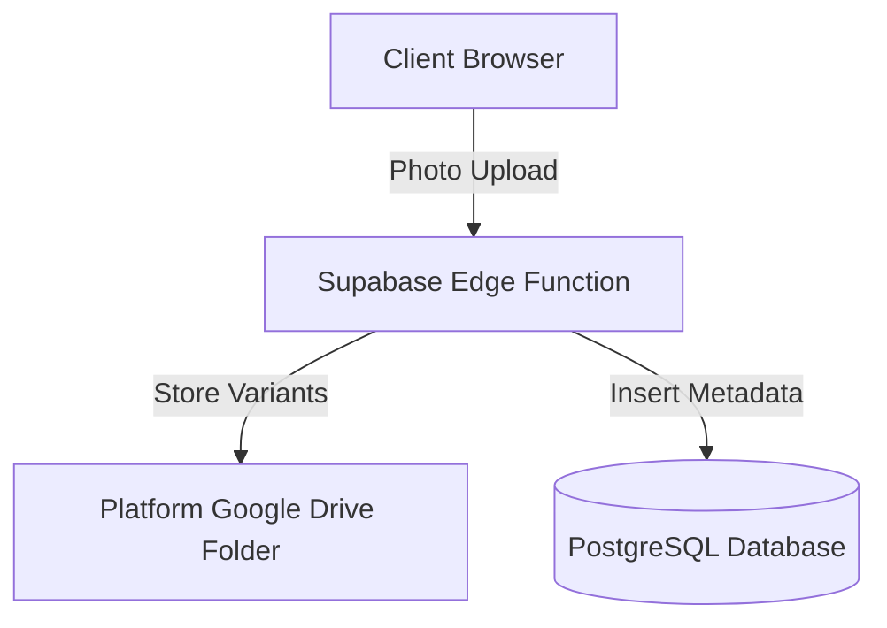

# Google Drive Service Account Integration - Final Architecture Report

This document outlines the final, production-grade architecture of the Google Drive integration for SnapFlip.

---

## 1. System Overview

SnapFlip integrates Google Drive as a platform-level storage engine. Rather than requiring users to authenticate individually via Google OAuth, the system acts as a secure custodian, performing all write, read, and delete operations using a platform-owned Google Cloud Service Account.



---

## 2. Authentication & Security Boundaries

1. **Client-Side:** The React frontend contains zero Google OAuth/credentials code, no redirection logic, and does not require users to log in or authorize. It is completely isolated from Google APIs.
2. **Server-Side (Supabase Edge Function):** The `drive-storage` Deno Edge Function handles the secure token exchange. It reads the base64-encoded `GOOGLE_SERVICE_ACCOUNT_KEY` secret from the Supabase environment, signs a custom RS256 JWT, exchanges it for a short-lived access token, and authorizes the Google Drive API.
3. **Storage Restrictions:** All uploads are restricted to a parent directory tree under `GOOGLE_DRIVE_FOLDER_ID`. Raw access to the Service Account's root drive is blocked by explicit API checks.

---

## 3. Database Schema Mapping

A single table (`storage_files`) manages the atomic links for all three generated image variants.

```sql
CREATE TABLE public.storage_files (
  id UUID PRIMARY KEY DEFAULT gen_random_uuid(),
  user_id UUID REFERENCES auth.users(id) ON DELETE CASCADE,
  album_id UUID REFERENCES public.albums(id) ON DELETE CASCADE,
  google_file_id VARCHAR(255) NOT NULL,
  google_folder_id VARCHAR(255) NOT NULL,
  original_path TEXT NOT NULL,
  optimized_path TEXT NOT NULL,
  thumbnail_path TEXT NOT NULL,
  mime_type VARCHAR(50) NOT NULL,
  original_size BIGINT NOT NULL,
  optimized_size BIGINT NOT NULL,
  thumbnail_size BIGINT NOT NULL,
  checksum VARCHAR(64) NOT NULL,
  created_at TIMESTAMPTZ DEFAULT now(),
  updated_at TIMESTAMPTZ DEFAULT now()
);
```

### Key Advantages:
* **Atomic Inserts:** Uploads are recorded in a single transaction, preventing orphaned records.
* **Efficient Lookups:** The `checksum` and `album_id` columns are indexed, enabling O(1) deduplication searches.
* **Auto-cleanups:** Database cascades delete storage records whenever their corresponding album or user is removed.
