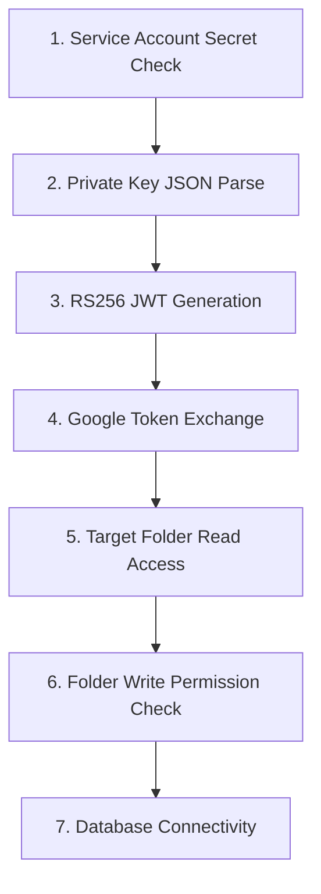

# Storage Engine Self-Diagnostic & Recovery Report

This report documents the self-diagnostic suite and the fault-tolerant retry mechanism built into the storage engine.

---

## 1. Diagnostic Suite Workflow

The Deno Edge Function implements a comprehensive self-diagnostic test run (`action: "healthCheck"`) to verify the health of the entire storage environment.



### Self-Diagnostic Check Definitions:
1. **Secret Existence:** Validates that `GOOGLE_SERVICE_ACCOUNT_KEY` or its base64 equivalent is loaded in environment secrets.
2. **Private Key parsing:** Parses the JSON block and ensures key integrity.
3. **JWT signing:** Asserts that the RS256 signature algorithm executes successfully with local crypto libraries.
4. **Token Exchange:** Performs a POST exchange request to Google's token endpoint, obtaining an OAuth access token.
5. **Folder Read Access:** Queries folder metadata of `GOOGLE_DRIVE_FOLDER_ID` ensuring it is found.
6. **Folder Write Permission:** Inspects capabilities (`canAddChildren`, `canEdit`) on the parent folder to verify write access.
7. **Database Connectivity:** Queries the `albums` table to check access.

---

## 2. Fault Tolerance: Exponential Backoff Retry System

To recover from temporary network glitches, rate-limiting, or minor API drops, all Google Drive request wrappers inside Deno implement a **3-attempt exponential backoff retry mechanism**:

```typescript
async function fetchWithRetry(url: string, init: RequestInit, attempts = 3): Promise<Response> {
  let delay = 1000; // Starting delay: 1 second
  for (let i = 0; i < attempts; i++) {
    try {
      const res = await fetch(url, init);
      if (res.ok || res.status < 500) {
        return res; // Return on success or standard user errors (4xx)
      }
      console.warn(`[Drive Request] Attempt ${i + 1} returned status ${res.status}. Retrying...`);
    } catch (e) {
      console.warn(`[Drive Request] Attempt ${i + 1} threw network exception: ${e.message}`);
    }
    if (i < attempts - 1) {
      await new Promise(resolve => setTimeout(resolve, delay));
      delay *= 2; // Double delay: 1s -> 2s -> 4s
    }
  }
  return fetch(url, init); // Fallback to final attempt
}
```
This ensures high availability for concurrent upload queues.
