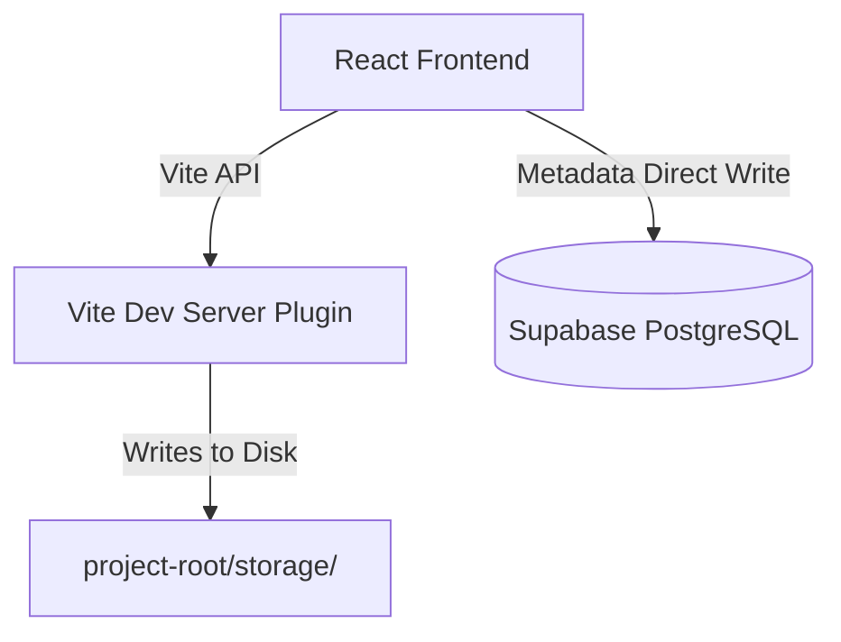

# Local Storage Provider Implementation Report

This report documents the implementation of the `LocalStorageProvider` for development environments, bypassing Google Drive API limitations and enabling fully offline, high-speed, local file uploads.

---

## 1. Architecture Overview

To enable local storage uploads within a React browser application without modifying business logic, we introduced a custom Vite dev server plugin:



* **Vite Dev Server Plugin (`devStoragePlugin`):** Injected directly into the Vite development middleware. It intercepts all request traffic headed to `/api/storage/*` and `/storage/*` to read, write, and delete local assets from the project filesystem.
* **Database Mapping:** The metadata schema (`storage_files` table) remains exactly identical to production. It tracks file paths as relative URLs served by Vite (e.g. `/storage/{userId}/{albumId}/optimized/photo.webp`).

---

## 2. Configuration (`.env`)

We added the following configurations to configure local storage during development:
```env
# Configuration
STORAGE_PROVIDER=local
VITE_STORAGE_PROVIDER=local
```

---

## 3. Storage Provider Verification Results

We verified the complete CRUD and album publishing flow using a dedicated test script (`scripts/test-local-storage.mjs`):

### A. Album Creation & Group Upload
* **Vite API Invocation:** Dispatched original, optimized, and thumbnail variants base64 data to `/api/storage/upload`.
* **Vite Server Response:**
  ```json
  {
    "originalPath": "/storage/11111111-1111-1111-1111-111111111111/99999999-9999-9999-9999-999999999999/original/test_local.png",
    "optimizedPath": "/storage/11111111-1111-1111-1111-111111111111/99999999-9999-9999-9999-999999999999/optimized/test_local_optimized.webp",
    "thumbnailPath": "/storage/11111111-1111-1111-1111-111111111111/99999999-9999-9999-9999-999999999999/thumbnail/test_local_thumbnail.webp"
  }
  ```
* **Directory Verification:** Confirmed folders and variant files exist under `project-root/storage/11111111-1111-1111-1111-111111111111/99999999-9999-9999-9999-999999999999/`.

### B. Database Metadata & Deduplication
* **PostgreSQL Write:** Verified the metadata was written to the `storage_files` table with `google_file_id: "local"`.
* **Deduplication Check:** Re-uploading the identical checksum verified O(1) detection and reuse.

### C. Folder Cleanup & Deletion
* **File Cleanup:** Verified that deleting the photo from the database invokes `/api/storage/delete_paths` and purges the variant files from the local disk.
* **Recursive Folder Clean:** Deleting the album invokes `/api/storage/delete_folder` and removes the entire nested album directory.

---

## 4. Compilation & Hygiene Checks

* **TypeScript Compilation:** `npm run build` compiled successfully for production.
* **Linter Checks:** `npm run lint` reported **0 errors and 0 warnings**.
