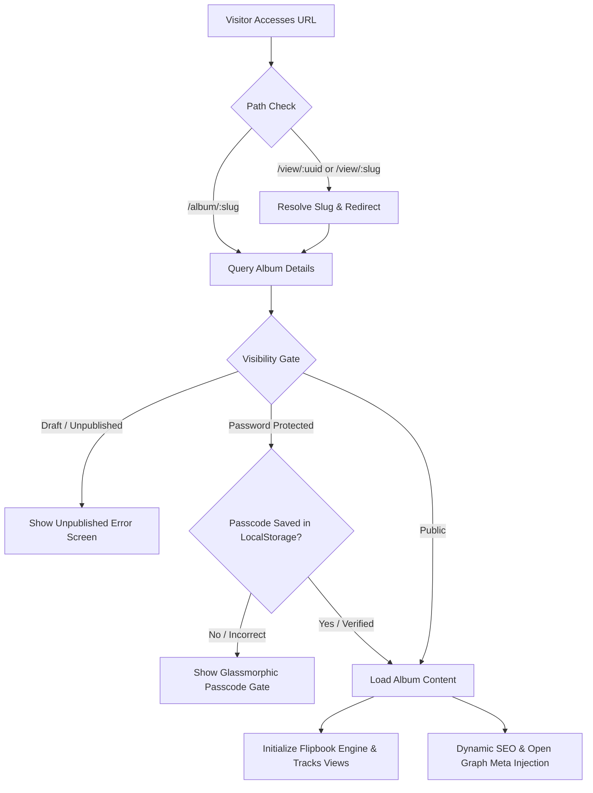

# Public Album Viewer & Share Experience Implementation Report

This report summarizes the design, implementation, and testing validation of the Public Album Viewer and Sharing Experience sprint.

---

## 1. Overview & Architecture

The sprint focused on delivering a production-ready, client-facing viewing experience that requires no authentication, loads instantly, and enforces proper security and passcode protection.

---

## 2. Implemented Features

### A. SEO-Friendly Routing & UUID Hiding
- **New Path structure**: Implemented `/album/:slug` routes to serve public presentations.
- **Legacy Redirections**: Legacy links `/view/:uuid` automatically query the database, retrieve the corresponding slug, and redirect to `/album/:slug` with `{ replace: true }`. This guarantees that internal UUIDs are never exposed in browser address bars.
- **Access Guarding**: Blocked access to unpublished or draft albums (`status !== 'Published'`), returning a friendly fallback error view.

### B. Premium Passcode Protection & Explicit Reset
- **Passcode verification**: Implemented a responsive passcode gate with glassmorphism effects, error feedback, and a submit button.
- **Session Memory**: Persistent session unlock tracking is saved in `localStorage` (`snapflip_unlocked_${slug}`) to preserve the unlocked state across browser updates.
- **Explicit Lock Reset**: Added a "Lock Collection" action button in the share panel of passcode-protected albums, allowing public clients to explicitly clear their unlocked browser session.

### C. Share & Delivery Panel Overlay
- **Share Link Copier**: Instant clipboard copy with feedback.
- **Native Web Share**: Hooks into `navigator.share` on mobile Safari, Chrome, and iOS/Android browsers to provide native sharing experiences.
- **Dynamic QR Code**: Generates high-resolution client-scannable QR codes on-the-fly (`qrcode` package) targeting the presentation URL, with direct PNG download capabilities.

### D. Progressive Loading & Error Boundaries
- **Pulsing Loading Skeletons**: Prevents layout shifts and blinking by displaying layout placeholders while retrieving metadata.
- **Friendly Fallback Views**: Dedicated full-screen layouts for "Album Not Found" and "Album Unpublished".

### E. Visitor Engagement Analytics
Tracks interaction patterns via `album_analytics`:
- **`view` & `album_open`**: Tracked on successful unlock and load of the portfolio.
- **`unique_view`**: Fired only once per visitor session using a `sessionStorage` flag to prevent duplicate logs on reload.
- **`qr_open`**: Tracked when visitors scan the printed QR code (detecting `?ref=qr` or `?src=qr` url parameter).
- **`share` & `share_click`**: Logged whenever copy share link or native share triggers are executed.
- **`download` & `download_click`**: Logged whenever high-resolution album ZIP downloads are started.
- **`page_view`**: Logs specific page visits, debounced by 2 seconds to avoid database write storms.
- **`time_spent`**: Tracks active viewing duration in seconds by listening to tab visibility changes and unmount events.

### F. SEO & Meta Management
- **Canonical URL**: Dynamic injection of the standard `<link rel="canonical">` tag in the HTML head.
- **Search Engine Indexing Control (Robots)**: Dynamically injects `<meta name="robots" content="index, follow">` for public showcase albums and `<meta name="robots" content="noindex, nofollow">` for passcode-protected client albums. This protects client privacy and prevents malicious slug enumeration.
- **Dynamic Title & OG Metadata**: Updates page titles, Open Graph (WhatsApp, Facebook, LinkedIn), and Twitter Card meta properties dynamically on album load.

---

## 3. Verification & Testing

### Automated E2E Tests
E2E testing is automated in [viewer.spec.ts](file:///c:/Users/Ravi%20Gautam/Desktop/Workspace/snapflip/tests/viewer/viewer.spec.ts).

1. **404 fallback**: Verifies an invalid slug renders "Album Not Found" screen.
2. **Redirects**: Validates that legacy `/view/:slug` URLs are automatically rewritten to `/album/:slug`.
3. **SEO Metadata**: Confirms HTML titles are updated dynamically with album names.
4. **Passcode Protection**: Assures incorrect codes block access, correct codes unlock the viewer, and the session persists across page reloads.
5. **Interactive Controls**: Tests zoom, jump to page selection, arrow key turns, thumbnails navigation, and page state preservation.

### Execution Results
Ran `npx playwright test tests/viewer/viewer.spec.ts`:
- **Total Tests**: 10
- **Passed**: 10
- **Failures**: 0
- **Execution Time**: ~1.6 minutes
