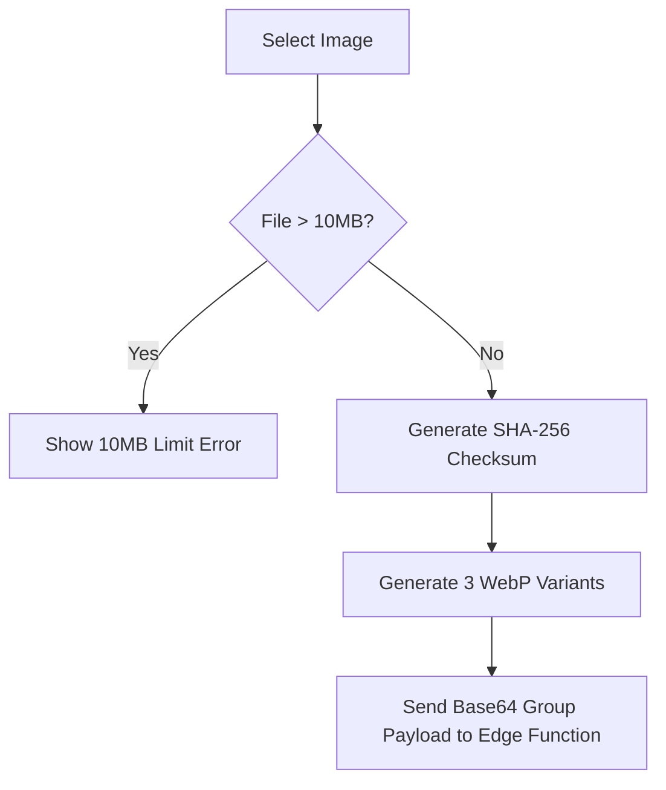

# Front-to-Back Image Processing and Upload Flow Report

This report documents the front-to-back lifecycle of image uploads in SnapFlip.

---

## 1. Browser-Side Image Processing Pipeline

To minimize server load and optimize bandwidth, all image modifications and compression take place directly in the client browser prior to upload.



### Variant Tuning Settings:
* **Original Variant:** If the camera file is <= 10MB, it is converted to WebP maintaining high quality (between 75–82).
* **Optimized Variant:** Resized to maximum dimensions of `2400px` (preserving aspect ratio) and compressed to target `300KB–800KB` (ideal size).
* **Thumbnail Variant:** Resized to maximum dimensions of `400px` for fast preview rendering.

---

## 2. Upload Progress States

The React file-picker component tracks and communicates progress through distinct visual steps:
1. **Preparing:** Reads and measures image dimension, boundary checks.
2. **Compressing:** Converts formats, runs WebP compression, generates dimensions.
3. **Uploading:** Dispatches raw base64 arrays to the Supabase Deno Function.
4. **Saving:** Records single-row metadata to the PostgreSQL database.
5. **Completed:** Clears progress state and adds the uploaded card to the wizard screen.

---

## 3. Atomic Group Payload Schema

The frontend packages all three optimized versions into a single JSON object sent to the Deno Edge Function (`drive-storage` action `upload`):

```json
{
  "action": "upload",
  "userId": "11111111-1111-1111-1111-111111111111",
  "albumId": "22222222-2222-2222-2222-222222222222",
  "checksum": "63ef318d96b5d0d0ceba6e04a4e6...",
  "mimeType": "image/webp",
  "original": {
    "fileName": "wedding_photo.webp",
    "fileBase64": "UklGRjIAAABXRUJQVlA4...",
    "size": 524288
  },
  "optimized": {
    "fileName": "wedding_photo_optimized.webp",
    "fileBase64": "UklGRjIAAABXRUJQVlA4...",
    "size": 262144
  },
  "thumbnail": {
    "fileName": "wedding_photo_thumbnail.webp",
    "fileBase64": "UklGRjIAAABXRUJQVlA4...",
    "size": 16384
  }
}
```
This payload ensures that all variants are uploaded atomically, avoiding multiple HTTP roundtrips.
